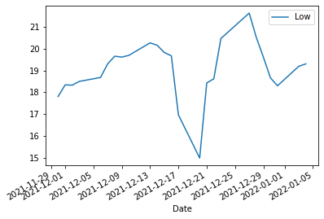

EM Turkey
---------

relationship between currency rate - inflation - stockexchange
~~~~~~~~~~~~~~~~~~~~~~~~~~~~~~~~~~~~~~~~~~~~~~~~~~~~~~~~~~~~~~

Turkey is right now (22/01/22) not the place to invest, but it is really
interesting because a lot is happening.

I’m particularly interested in the relation between currency (Forex) and
stock market.

From september 5th (8.5) till december 19th (16.70) the Turkish Lira
dropped almost half in value. An intervention of the Turkish national
bank (selling of reserves) got the Lira back up till (13).

A report from EMFI predicts an inversion of the yield curve and an
inflation of (70%)!! for 2022. “SELL” is the advice to bondowners ….

.. math:: \beta\Gamma

.. parsed-literal::

    2022-01-21

.. parsed-literal::

    <Response [200]>
    https://sdw-wsrest.ecb.europa.eu/service/data/EXR/D.TRY.EUR.SP00.A?startPeriod=2021-12-01&endPeriod=2022-01-21

.. parsed-literal::

    <?xml version="1.0" encoding="UTF-8"?><message:GenericData xmlns:message="http://www.sdmx.org/resources/sdmxml/schemas/v2_1/message" xmlns:common="http://www.sdmx.org/resources/sdmxml/schemas/v2_1/common" xmlns:xsi="http://www.w3.org/2001/XMLSchema-instance" xmlns:generic="http://www.sdmx.org/resources/sdmxml/schemas/v2_1/data/generic" xsi:schemaLocation="http://www.sdmx.org/resources/sdmxml/schemas/v2_1/message https://sdw-wsrest.ecb.europa.eu:443/vocabulary/sdmx/2_1/SDMXMessage.xsd http://www.sdmx.org/resources/sdmxml/schemas/v2_1/common https://sdw-wsrest.ecb.europa.eu:443/vocabulary/sdmx/2_1/SDMXCommon.xsd http://www.sdmx.org/resources/sdmxml/schemas/v2_1/data/generic https://sdw-wsrest.ecb.europa.eu:443/vocabulary/sdmx/2_1/SDMXDataGeneric.xsd">
    <message:Header>
    <message:ID>5970e66c-46a8-454e-a74c-1762408d68fc</message:ID>
    <message:Test>false</message:Test>
    <message:Prepared>2022-01-22T19:38:01.613+01:00</message:Prepared>
    <message:Sender id="ECB"/>
    <message:Structure structureID="

Hmmm, the response is in XML. Not impossible, but also not the easiest
format to work within Pandas. Fortunately, the ECB’s API lets us get the
data in CSV format by specifying it in the header of the request.

.. parsed-literal::

    <Response [200]>

.. parsed-literal::

    'KEY,FREQ,CURRENCY,CURRENCY_DENOM,EXR_TYPE,EXR_SUFFIX,TIME_PERIOD,OBS_VALUE,OBS_STATUS,OBS_CONF,OBS_PRE_BREAK,OBS_COM,TIME_FORMAT,BREAKS,COLLECTION,COMPILING_ORG,DISS_ORG,DOM_SER_IDS,PUBL_ECB,PUBL_MU,PUBL_PUBLIC,UNIT_INDEX_BASE,COMPILATION,COVERAGE,DECIMALS,NAT_TITLE,SOURCE_AGENCY,SOURCE_PUB,TITLE,TITLE_COMPL,UNIT,UNIT_MULT\r\nEXR.D.TRY.EUR.SP00.A,D,TRY,EUR,SP00,A,2021-12-01,15.1664,A,F,,,P1D,,A,,,,,,,,"Before 1st January 2005 Turkish lira (TRL) divided by 1,000,000 is used",,4,,DE2,,Turkish lira/Euro,"ECB reference exchange rate, Turkish lira/Euro, 2:15 pm (C.E.T.)",TRY,0\r\nEXR.D.TRY.EUR.SP00.A,D,TRY,EUR,SP00,A,2021-12-02,15.2937,A,F,,,P1D,,A,,,,,,,,"Before 1st January 2005 Turkish lira (TRL) divided by 1,000,000 is used",,4,,DE2,,Turkish lira/Euro,"ECB reference exchange rate, Turkish lira/Euro, 2:15 pm (C.E.T.)",TRY,0\r\nEXR.D.TRY.EUR.SP00.A,D,TRY,EUR,SP00,A,2021-12-03,15.6131,A,F,,,P1D,,A,,,,,,,,"Before 1st January 2005 Turkish lira (TRL) divided by 1,000,000 is used",,4,,DE2,,Turkish li'

The columns we need are ‘TIME_PERIOD’ for the dates and ‘OBS_VALUE’ for
the prices. Let’s also do a sanity check on the prices in ‘OBS_VALUE’.

.. parsed-literal::

    count    38.000000
    mean     15.413537
    std       1.384352
    min      12.652500
    25%      15.145400
    50%      15.432700
    75%      15.672475
    max      20.043400
    Name: OBS_VALUE, dtype: float64

.. raw:: html

    

    
    <table border="1" class="dataframe">
      <thead>
        <tr style="text-align: right;">
          <th></th>
          <th>OBS_VALUE</th>
        </tr>
        <tr>
          <th>TIME_PERIOD</th>
          <th></th>
        </tr>
      </thead>
      <tbody>
        <tr>
          <th>2022-01-10</th>
          <td>15.7183</td>
        </tr>
        <tr>
          <th>2022-01-11</th>
          <td>15.6960</td>
        </tr>
        <tr>
          <th>2022-01-12</th>
          <td>15.5922</td>
        </tr>
        <tr>
          <th>2022-01-13</th>
          <td>15.5744</td>
        </tr>
        <tr>
          <th>2022-01-14</th>
          <td>15.5256</td>
        </tr>
        <tr>
          <th>2022-01-17</th>
          <td>15.2757</td>
        </tr>
        <tr>
          <th>2022-01-18</th>
          <td>15.4447</td>
        </tr>
        <tr>
          <th>2022-01-19</th>
          <td>15.4207</td>
        </tr>
        <tr>
          <th>2022-01-20</th>
          <td>15.2094</td>
        </tr>
        <tr>
          <th>2022-01-21</th>
          <td>15.2230</td>
        </tr>
      </tbody>
    </table>
    

the spike is the FX - market is 2021-12-20 where you get 20.0434 Lira
for 1 Euro.

.. parsed-literal::

    <AxesSubplot:xlabel='TIME_PERIOD'>

Turkish lira against EURO - data taken from ECB, you can see a spike at
december 20th. Subsequently there is an intervention from the Turkish
national bank, supporting the Turkish lira : - statement by president
Erdogan - sell of foreign reserves

The new deposit scheme, called byBloomberg a rate increase in disguise,
could be short-term gain and longterm pain, as the mechanism basically
transfers FX risks from the private sector to the government, with the
latter guaranteeing depositor’s returns by covering any losses caused by
a depreciation in the lira, as long as those losses exceed the bank’s
interest rates. This in eAect creates a liability for the government,
which would come back to bite in case the lira weakens again. To make
matters worse, authorities might choose to monetize the obligation, thus
putting more pressure on inCation and the lira, creating a vicious cycle
that could get out of

Summarizing, Turkey’s outlook includes more inflation, more long-term
currency depreciation and no interest rate hikes to correct these moves;
on the contrary, it looks like the president will continue to blame
everybody and everything else but his beliefs. Brace yourself, Turkey.

Now we import data from the turkish stock exchange, we use the iShares
MSCI Turkey.

.. parsed-literal::

    [*********************100%***********************]  1 of 1 completed

.. raw:: html

    

    
    <table border="1" class="dataframe">
      <thead>
        <tr style="text-align: right;">
          <th></th>
          <th>Open</th>
          <th>High</th>
          <th>Low</th>
          <th>Close</th>
          <th>Adj Close</th>
          <th>Volume</th>
        </tr>
        <tr>
          <th>Date</th>
          <th></th>
          <th></th>
          <th></th>
          <th></th>
          <th></th>
          <th></th>
        </tr>
      </thead>
      <tbody>
        <tr>
          <th>2021-12-21</th>
          <td>19.500000</td>
          <td>19.850000</td>
          <td>18.430000</td>
          <td>19.379999</td>
          <td>19.379999</td>
          <td>2271800</td>
        </tr>
        <tr>
          <th>2021-12-22</th>
          <td>19.379999</td>
          <td>19.549999</td>
          <td>18.620001</td>
          <td>18.980000</td>
          <td>18.980000</td>
          <td>557400</td>
        </tr>
        <tr>
          <th>2021-12-23</th>
          <td>20.799999</td>
          <td>21.690001</td>
          <td>20.459999</td>
          <td>20.900000</td>
          <td>20.900000</td>
          <td>1899200</td>
        </tr>
        <tr>
          <th>2021-12-27</th>
          <td>21.799999</td>
          <td>22.090000</td>
          <td>21.620001</td>
          <td>21.719999</td>
          <td>21.719999</td>
          <td>1162300</td>
        </tr>
        <tr>
          <th>2021-12-28</th>
          <td>20.700001</td>
          <td>21.010000</td>
          <td>20.510000</td>
          <td>20.690001</td>
          <td>20.690001</td>
          <td>395300</td>
        </tr>
        <tr>
          <th>2021-12-29</th>
          <td>20.100000</td>
          <td>20.410000</td>
          <td>19.610001</td>
          <td>20.059999</td>
          <td>20.059999</td>
          <td>390300</td>
        </tr>
        <tr>
          <th>2021-12-30</th>
          <td>19.389999</td>
          <td>19.420000</td>
          <td>18.660000</td>
          <td>18.990000</td>
          <td>18.990000</td>
          <td>768100</td>
        </tr>
        <tr>
          <th>2021-12-31</th>
          <td>18.809999</td>
          <td>18.900000</td>
          <td>18.299999</td>
          <td>18.580000</td>
          <td>18.580000</td>
          <td>790500</td>
        </tr>
        <tr>
          <th>2022-01-03</th>
          <td>19.309999</td>
          <td>20.469999</td>
          <td>19.190001</td>
          <td>19.990000</td>
          <td>19.990000</td>
          <td>1607000</td>
        </tr>
        <tr>
          <th>2022-01-04</th>
          <td>19.700001</td>
          <td>19.830000</td>
          <td>19.299999</td>
          <td>19.620001</td>
          <td>19.620001</td>
          <td>305200</td>
        </tr>
      </tbody>
    </table>
    

you can see : 2021-12-20 a 15.290000 low, which is same date as currency
hike. **hypothesis:** somebody is closely watching exchange rate on spot
market and hits “sell-button” on stock-exchange?

.. parsed-literal::

    <AxesSubplot:xlabel='Date'>

*graph is turkish MSCI index in dollar*

.. parsed-literal::

    [*********************100%***********************]  1 of 1 completed

.. parsed-literal::

    <AxesSubplot:xlabel='Date'>

in order to get inflation data (which is probably even higher) a
technique “webscraping” is used

.. parsed-literal::

    <Response [200]>
    test

Credit Default Swaps – different types for CDS on ABS - continued -
Fixed Cap: Maximum amount that the protection seller has to pay buyer is
the Fixed Rate - Variable Cap: Protection seller has to make up any
interest shortfall on the bond up to LIBOR plus the Fixed Rate - No Cap:
Protection seller has to make up any interest shortfall on the bond

*is there a way to get a headstart in information about currency : libor
rate, cds … ?*
