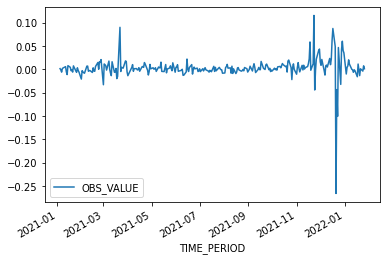
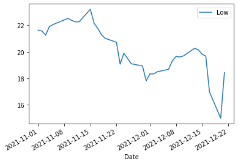
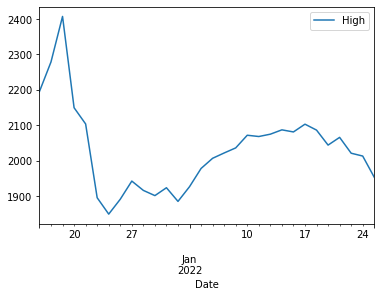
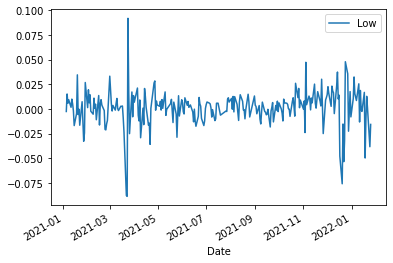
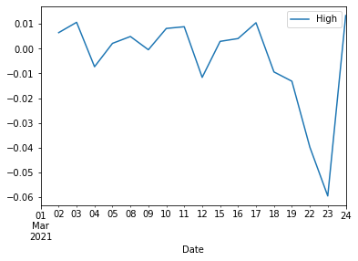

EM Turkey
---------

relationship between currency rate - bondmarket - stockexchange
~~~~~~~~~~~~~~~~~~~~~~~~~~~~~~~~~~~~~~~~~~~~~~~~~~~~~~~~~~~~~~~

Turkey is right now (22/01/22) not the place to invest, but it is really
interesting because a lot is happening.

I’m particularly interested in the relation between currency (Forex) and
stock market. I do not have acces to detailled data, which is partly due
to me pennypinching…

From september 5th (8.5) till december 19th (16.70) the Turkish Lira
dropped almost half in value. An intervention of the Turkish national
bank (selling of reserves) got the Lira back up till (13).

A report from EMFI predicts an inversion of the yield curve and an
inflation of (70%)!! for 2022. “SELL” is the advice to bondowners ….

Future outlook : an inversion of the yield curve in the US is a
reasonable predictor of recession. So somewhere 2022-2023 there should
be a buying opportunity.

.. math:: \beta\Gamma

.. parsed-literal::

    2022-01-26

.. parsed-literal::

    <Response [200]>

The columns we need are ‘TIME_PERIOD’ for the dates and ‘OBS_VALUE’ for
the prices. Let’s also do a sanity check on the prices in ‘OBS_VALUE’.

.. parsed-literal::

    count    276.000000
    mean      10.830891
    std        2.189987
    min        8.397500
    25%        9.709275
    50%       10.147600
    75%       10.969675
    max       20.043400
    Name: OBS_VALUE, dtype: float64

.. raw:: html

    

    
    <table border="1" class="dataframe">
      <thead>
        <tr style="text-align: right;">
          <th></th>
          <th>OBS_VALUE</th>
        </tr>
        <tr>
          <th>TIME_PERIOD</th>
          <th></th>
        </tr>
      </thead>
      <tbody>
        <tr>
          <th>2021-01-04</th>
          <td>NaN</td>
        </tr>
        <tr>
          <th>2021-01-05</th>
          <td>0.001270</td>
        </tr>
        <tr>
          <th>2021-01-06</th>
          <td>-0.001544</td>
        </tr>
        <tr>
          <th>2021-01-07</th>
          <td>-0.006261</td>
        </tr>
        <tr>
          <th>2021-01-08</th>
          <td>0.001767</td>
        </tr>
        <tr>
          <th>...</th>
          <td>...</td>
        </tr>
        <tr>
          <th>2022-01-20</th>
          <td>-0.013702</td>
        </tr>
        <tr>
          <th>2022-01-21</th>
          <td>0.000894</td>
        </tr>
        <tr>
          <th>2022-01-24</th>
          <td>-0.004001</td>
        </tr>
        <tr>
          <th>2022-01-25</th>
          <td>0.007268</td>
        </tr>
        <tr>
          <th>2022-01-26</th>
          <td>0.001008</td>
        </tr>
      </tbody>
    </table>
    
276 rows × 1 columns

    

the spike is the FX - market is 2021-12-20 where you get 20.0434 Lira
for 1 Euro.

The stockmarket came down on monday 20/12.

.. parsed-literal::

    <AxesSubplot:xlabel='TIME_PERIOD'>

OK another spike on 2021-03 …. what happened on stock exchange?

Turkish lira against EURO - data taken from ECB, you can see a spike at
december 20th. Subsequently there is an intervention from the Turkish
national bank, supporting the Turkish lira : - statement by president
Erdogan - sell of foreign reserves

The new deposit scheme, called byBloomberg a rate increase in disguise,
could be short-term gain and longterm pain, as the mechanism basically
transfers FX risks from the private sector to the government, with the
latter guaranteeing depositor’s returns by covering any losses caused by
a depreciation in the lira, as long as those losses exceed the bank’s
interest rates. This in eAect creates a liability for the government,
which would come back to bite in case the lira weakens again. To make
matters worse, authorities might choose to monetize the obligation, thus
putting more pressure on inCation and the lira, creating a vicious cycle
that could get out of

Summarizing, Turkey’s outlook includes more inflation, more long-term
currency depreciation and no interest rate hikes to correct these moves;
on the contrary, it looks like the president will continue to blame
everybody and everything else but his beliefs. Brace yourself, Turkey.

Now we import data from the turkish stock exchange, we use the iShares
MSCI Turkey.

.. parsed-literal::

    [*********************100%***********************]  1 of 1 completed

.. raw:: html

    

    
    <table border="1" class="dataframe">
      <thead>
        <tr style="text-align: right;">
          <th></th>
          <th>Open</th>
          <th>High</th>
          <th>Low</th>
          <th>Close</th>
          <th>Adj Close</th>
          <th>Volume</th>
        </tr>
        <tr>
          <th>Date</th>
          <th></th>
          <th></th>
          <th></th>
          <th></th>
          <th></th>
          <th></th>
        </tr>
      </thead>
      <tbody>
        <tr>
          <th>2021-12-08</th>
          <td>19.860001</td>
          <td>19.950001</td>
          <td>19.650000</td>
          <td>19.900000</td>
          <td>19.808952</td>
          <td>306300</td>
        </tr>
        <tr>
          <th>2021-12-09</th>
          <td>20.000000</td>
          <td>20.100000</td>
          <td>19.610001</td>
          <td>19.680000</td>
          <td>19.589960</td>
          <td>398400</td>
        </tr>
        <tr>
          <th>2021-12-10</th>
          <td>19.840000</td>
          <td>19.930000</td>
          <td>19.690001</td>
          <td>19.889999</td>
          <td>19.798998</td>
          <td>177100</td>
        </tr>
        <tr>
          <th>2021-12-13</th>
          <td>20.260000</td>
          <td>20.680000</td>
          <td>20.260000</td>
          <td>20.480000</td>
          <td>20.480000</td>
          <td>461600</td>
        </tr>
        <tr>
          <th>2021-12-14</th>
          <td>20.350000</td>
          <td>20.580000</td>
          <td>20.150000</td>
          <td>20.430000</td>
          <td>20.430000</td>
          <td>397400</td>
        </tr>
        <tr>
          <th>2021-12-15</th>
          <td>20.049999</td>
          <td>20.309999</td>
          <td>19.820000</td>
          <td>20.230000</td>
          <td>20.230000</td>
          <td>916600</td>
        </tr>
        <tr>
          <th>2021-12-16</th>
          <td>19.840000</td>
          <td>19.950001</td>
          <td>19.670000</td>
          <td>19.879999</td>
          <td>19.879999</td>
          <td>496200</td>
        </tr>
        <tr>
          <th>2021-12-17</th>
          <td>17.400000</td>
          <td>17.719999</td>
          <td>16.969999</td>
          <td>17.110001</td>
          <td>17.110001</td>
          <td>2584300</td>
        </tr>
        <tr>
          <th>2021-12-20</th>
          <td>15.290000</td>
          <td>21.500000</td>
          <td>15.000000</td>
          <td>20.740000</td>
          <td>20.740000</td>
          <td>8629000</td>
        </tr>
        <tr>
          <th>2021-12-21</th>
          <td>19.500000</td>
          <td>19.850000</td>
          <td>18.430000</td>
          <td>19.379999</td>
          <td>19.379999</td>
          <td>2271800</td>
        </tr>
      </tbody>
    </table>
    

**What is happening on 2021-12-17 ?** People selling of, are well
informed, but how?

.. parsed-literal::

    <AxesSubplot:xlabel='Date'>

*graph is turkish MSCI index in dollar*

.. parsed-literal::

    [*********************100%***********************]  1 of 1 completed
                        Low
    Date                   
    2021-12-15  2145.600098
    2021-12-16  2175.500000
    2021-12-17  2071.300049
    2021-12-20  1914.000000
    2021-12-21  1884.699951
                       High
    Date                   
    2021-12-15  2195.100098
    2021-12-16  2278.600098
    2021-12-17  2406.899902
    2021-12-20  2149.399902
    2021-12-21  2103.600098

.. parsed-literal::

    <AxesSubplot:xlabel='Date'>

.. parsed-literal::

    [*********************100%***********************]  1 of 1 completed

.. parsed-literal::

    <AxesSubplot:xlabel='Date'>

.. parsed-literal::

     daily spread of  :  13  %

The big question is : could the exchange-rate rise be a warning? monday
2021-12-14 16.2092 tuesday 2021-12-15 16.5612 wednesdag 2021-12-16
17.5824

.. parsed-literal::

    6.1662198391420935

A currency change of 6 percent in one day? — can I backtest this? Seems
in March same thing happened.

.. parsed-literal::

    [*********************100%***********************]  1 of 1 completed

.. parsed-literal::

    <AxesSubplot:xlabel='Date'>

